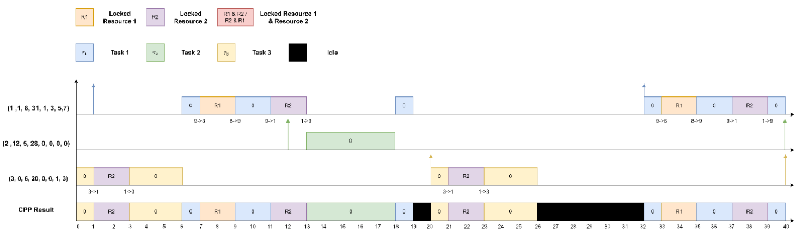

# Handling Priority Inversion via ceiling-priority protocol (CPP) in μC/OS-II RM Scheduling  

## Objective
Implement the ceiling-priority protocol (CPP) based on the RM scheduler in μC/OS-II

## Problem Definition
uC/OS-II uses a variation of the priority inheritance protocol to deal with priority inversions. In this assignment, you are going to implement the CPP based on the RM scheduler in uC/OS-II.  

### Example Task Set
| Task ID | Arrival Time | Execution Time | Period | R1 Lock Time | R1 Unlock Time | R2 Lock Time | R2 Unlock Time |
|---------|--------------|----------------|--------|--------------|----------------|--------------|----------------|
| τ1      | 2            | 6              | 15     | 1            | 4              | 2            | 5              |
| τ2      | 0            | 7              | 20     | -            | -              | 1            | 3              |
---

## Output Format

The output of the scheduler will be displayed in the following format:

| Tick | Event         | Current Task ID | Next Task ID | Response Time | Blocking Time | Preemption Time | Resource
|-------|----------------|-----------------|--------------|---------------|-----------------|-------------| --------
| 1     | Preemption     | 1 (1)           | 2 (1)        | 1             | 1               | 0           | 
| 2     | Completion     | 2 (1)           | 1 (2)        | 2             | 0               | 0           |
| 3     | MissDeadline   | 2 (1)           | ---          | ---           | ---             | ---         |
| 4     | LockResource   | 2 (1)           | ---          | ---           | ---             | ---         |  R#
| 5     | UnLockResource | 2 (1)           | ---          | ---           | ---             | ---         |  R#
  
### Event Description
- **Preemption**: Task with higher priority takes over the CPU.
- **Completion**: Task finishes execution.
- **MissDeadline**: Task failed to complete within its period.
---
- **LockResource**: Task lock R# resource
- **UnLockResource**: Task unlock R# resource
- **Blocking Time**: Time blocked by task which priority lower than itself.
- **Preemption Time**: Time blocked by task which priority higher than itself.  

---

## Results

The following figure shows the scheduling result of **Task Set 1** using the Rate Monotonic algorithm.
### Example Task Set 1
| Task ID | Arrival Time | Execution Time | Period | R1 Lock Time | R1 Unlock Time | R2 Lock Time | R2 Unlock Time |
|---------|--------------|----------------|--------|--------------|----------------|--------------|----------------|
| τ1      | 2            | 6              | 15     | 1            | 5              | 2            | 4              |
| τ2      | 0            | 7              | 20     | 5            | 6              | 1            | 3              |

---

The following figure shows the scheduling result of **Task Set 2** using the Rate Monotonic algorithm
### Example Task Set 2
| Task ID | Arrival Time | Execution Time | Period | R1 Lock Time | R1 Unlock Time | R2 Lock Time | R2 Unlock Time |
|---------|--------------|----------------|--------|--------------|----------------|--------------|----------------|
| τ1      | 1            | 8              | 31     | 1            | 3              | 5            | 7              |
| τ2      | 12           | 5              | 28     | -            | -              | -            | -              |
| τ3      | 0            | 6              | 20     | -            | -              | 1            | 3              |

---  

